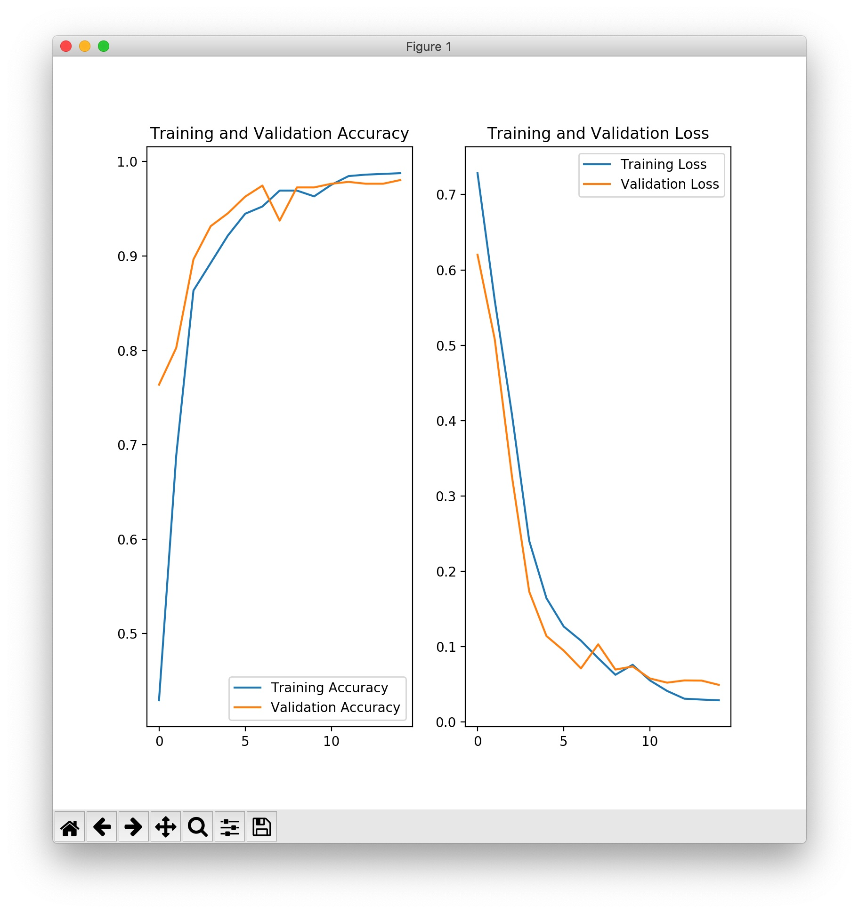
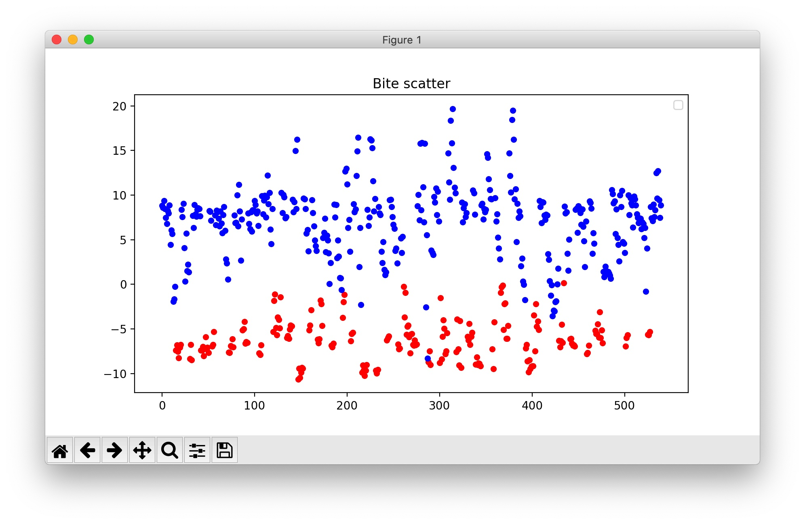

# Tensorflow Image Classifier Demo
A image classifier base on tensorflow: train, predict and serve demo.

## Prepare
Before the train, you should prepare your dataset, and organized them as `./dataset` path:
```bash
dataset
├── train
│   ├── bite
│   │   ├── 2020-02-26_17-27_frame_2232.jpg
│   │   ├── 2020-02-26_17-27_frame_2232_shift_1.jpg
│   │   ...
│   │
│   └── no_bite
│       ├── 2020-02-26_17-27_frame_2202.jpg
│       ├── 2020-02-26_17-27_frame_2202_shift_1.jpg
│       ...
│
└── validation
    ├── bite
    │   ├── 2020-02-26_17-27_frame_2226.jpg
    │   ├── 2020-02-26_17-27_frame_2226_shift_1.jpg
    │   ...
    │
    └── no_bite
        ├── 2020-02-26_17-27_frame_2184.jpg
        ├── 2020-02-26_17-27_frame_2184_shift_1.jpg
        ...
```

## Train and Save model
Then train and save your model
```bash
$ python train.py
total training bite images: 249
total training no_bite images: 531
total validation bite images: 192
total validation no_bite images: 348
--
Total training images: 780
Total validation images: 540
Found 780 images belonging to 2 classes.
Found 540 images belonging to 2 classes.
2020-03-15 13:48:53.207752: I tensorflow/core/platform/cpu_feature_guard.cc:142] Your CPU supports instructions that this TensorFlow binary was not compiled to use: AVX2 FMA
2020-03-15 13:48:53.224110: I tensorflow/compiler/xla/service/service.cc:168] XLA service 0x13ed7b040 initialized for platform Host (this does not guarantee that XLA will be used). Devices:
2020-03-15 13:48:53.224141: I tensorflow/compiler/xla/service/service.cc:176]   StreamExecutor device (0): Host, Default Version
Model: "sequential"
_________________________________________________________________
Layer (type)                 Output Shape              Param #
=================================================================
conv2d (Conv2D)              (None, 150, 150, 16)      448
_________________________________________________________________
max_pooling2d (MaxPooling2D) (None, 75, 75, 16)        0
_________________________________________________________________
conv2d_1 (Conv2D)            (None, 75, 75, 32)        4640
_________________________________________________________________
max_pooling2d_1 (MaxPooling2 (None, 37, 37, 32)        0
_________________________________________________________________
conv2d_2 (Conv2D)            (None, 37, 37, 64)        18496
_________________________________________________________________
max_pooling2d_2 (MaxPooling2 (None, 18, 18, 64)        0
_________________________________________________________________
flatten (Flatten)            (None, 20736)             0
_________________________________________________________________
dense (Dense)                (None, 512)               10617344
_________________________________________________________________
predictions (Dense)          (None, 1)                 513
=================================================================
Total params: 10,641,441
Trainable params: 10,641,441
Non-trainable params: 0
_________________________________________________________________
Press enter to train...
WARNING:tensorflow:From train.py:117: Model.fit_generator (from tensorflow.python.keras.engine.training) is deprecated and will be removed in a future version.
Instructions for updating:
Please use Model.fit, which supports generators.
WARNING:tensorflow:sample_weight modes were coerced from
  ...
    to
  ['...']
WARNING:tensorflow:sample_weight modes were coerced from
  ...
    to
  ['...']
Train for 6 steps, validate for 4 steps
Epoch 1/15
6/6 [==============================] - 8s 1s/step - loss: 0.7216 - accuracy: 0.4294 - val_loss: 0.6202 - val_accuracy: 0.7637
Epoch 2/15
6/6 [==============================] - 7s 1s/step - loss: 0.5635 - accuracy: 0.6887 - val_loss: 0.5079 - val_accuracy: 0.8027
Epoch 3/15
6/6 [==============================] - 7s 1s/step - loss: 0.3965 - accuracy: 0.8635 - val_loss: 0.3257 - val_accuracy: 0.8965
Epoch 4/15
6/6 [==============================] - 7s 1s/step - loss: 0.2316 - accuracy: 0.8926 - val_loss: 0.1731 - val_accuracy: 0.9316
Epoch 5/15
6/6 [==============================] - 7s 1s/step - loss: 0.1519 - accuracy: 0.9218 - val_loss: 0.1142 - val_accuracy: 0.9453
Epoch 6/15
6/6 [==============================] - 7s 1s/step - loss: 0.1181 - accuracy: 0.9448 - val_loss: 0.0950 - val_accuracy: 0.9629
Epoch 7/15
6/6 [==============================] - 7s 1s/step - loss: 0.1032 - accuracy: 0.9525 - val_loss: 0.0713 - val_accuracy: 0.9746
Epoch 8/15
6/6 [==============================] - 7s 1s/step - loss: 0.0764 - accuracy: 0.9693 - val_loss: 0.1033 - val_accuracy: 0.9375
Epoch 9/15
6/6 [==============================] - 7s 1s/step - loss: 0.0596 - accuracy: 0.9693 - val_loss: 0.0697 - val_accuracy: 0.9727
Epoch 10/15
6/6 [==============================] - 7s 1s/step - loss: 0.0676 - accuracy: 0.9632 - val_loss: 0.0738 - val_accuracy: 0.9727
Epoch 11/15
6/6 [==============================] - 7s 1s/step - loss: 0.0537 - accuracy: 0.9755 - val_loss: 0.0580 - val_accuracy: 0.9766
Epoch 12/15
6/6 [==============================] - 7s 1s/step - loss: 0.0367 - accuracy: 0.9847 - val_loss: 0.0524 - val_accuracy: 0.9785
Epoch 13/15
6/6 [==============================] - 7s 1s/step - loss: 0.0276 - accuracy: 0.9862 - val_loss: 0.0553 - val_accuracy: 0.9766
Epoch 14/15
6/6 [==============================] - 8s 1s/step - loss: 0.0299 - accuracy: 0.9870 - val_loss: 0.0551 - val_accuracy: 0.9766
Epoch 15/15
```
After train, You will get a train figure like below:

And a saved model:
```bash
./model/
└── 2
    ├── assets
    ├── saved_model.pb
    └── variables
        ├── variables.data-00000-of-00001
        └── variables.index
```

## Predict
You can run some test by feed some images to your model, for demo I just feed some image form my validation dataset.
```bash
$ python prediction.py
2020-03-17 00:25:32.206813: I tensorflow/core/platform/cpu_feature_guard.cc:142] Your CPU supports instructions that this TensorFlow binary was not compiled to use: AVX2 FMA
2020-03-17 00:25:32.220385: I tensorflow/compiler/xla/service/service.cc:168] XLA service 0x147ff48e0 initialized for platform Host (this does not guarantee that XLA will be used). Devices:
2020-03-17 00:25:32.220416: I tensorflow/compiler/xla/service/service.cc:176]   StreamExecutor device (0): Host, Default Version
predictions: [[-7.405302]]
predictions: [[-8.9535]]
predictions: [[-5.525764]]
predictions: [[-6.7625623]]
predictions: [[-6.0705853]]
predictions: [[9.998525]]
predictions: [[7.239306]]
predictions: [[9.381474]]
predictions: [[1.3258849]]
predictions: [[7.448014]]
Cost time: 0.3947470188140869
predict all cost time: 14.773498773574829
No handles with labels found to put in legend.
```
Will get the prediction result:


*PS: you can change the image path to your images*

## Deploy as a prediction server
### Run a server
```bash
$ python server.py
2020-03-17 00:32:05.737426: I tensorflow/core/platform/cpu_feature_guard.cc:142] Your CPU supports instructions that this TensorFlow binary was not compiled to use: AVX2 FMA
2020-03-17 00:32:05.750697: I tensorflow/compiler/xla/service/service.cc:168] XLA service 0x13e88a2f0 initialized for platform Host (this does not guarantee that XLA will be used). Devices:
2020-03-17 00:32:05.750717: I tensorflow/compiler/xla/service/service.cc:176]   StreamExecutor device (0): Host, Default Version
Load model success...
[2020-03-17 00:32:06 +0800] [88584] [INFO] Goin' Fast @ http://0.0.0.0:8007
[2020-03-17 00:32:06 +0800] [88584] [INFO] Starting worker [88584]
```

### Run a client to test
```bash
$ python client.py
cost time: 0.11507201194763184
b'{"prediction":-6.943365097}'
```

## Drawbacks
1. only support two kinds of image classify
2. method of save_model will deprecated in later version
3. no GPU support
...

## Reference
1. [Image classification | TensorFlow Core](https://www.tensorflow.org/tutorials/images/classification)
2. [tf.keras.models.save_model | TensorFlow Core v2.1.0](https://www.tensorflow.org/api_docs/python/tf/keras/models/save_model)
3. [Sanic — Sanic 19.12.2 documentation](https://sanic.readthedocs.io/en/latest/)
